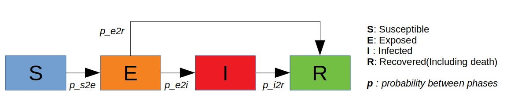
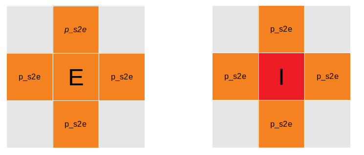

## COVID-19 Outbreaks Simulation and Analysis by an Extended SEIR Model

>Georgia Tech CSE6730 Project-2

### Abstract

Since the first coronavirus (COVID-19) outbreaks in Wuhan, China, the COVID-19 viral disease has swept into at least 184 countries and killed more than 94,000 people.The US has become a new "center" of the outbreaks as the number of confirmed cases climbed over 450000 and the number of death reached to 16000 by 9th April 2020. It is crucial for the public to understand the transmission pattern of the disease and to take proper measures accordingly. 

Groups of scientists in China, German claimed that people who are infected but do not have symptoms, or have not yet developed symptoms, can also infect others. This transmission pattern distinct among other epidemic transmission patterns such as SARS or MERS. Traditional models such as SIR or SEIR may not describe the spread correctly. Thus, an extended SEIR model was proposed and analyzed in this project paper to address the asymtomatic transmission during the incubation period.
ODE, cellular automata and Markov Chain are the three approaches being used to deploy the conceptual models. The simulated results are collected, and analyzed. Real world data is also used to validate the prediction models. 

##### Modified SEIR

##### Modified Infectious Pattern (CA model as an example)

### Github Repo

Project Github Repo: https://github.gatech.edu/mguo34/COVID-19-Simulation

### Authors , Contributions

- Muyang Guo , Cellular Automata model

- Dayu Zhu , ODE model

- Yibo Wang , Markov Chain Model

### Models

Part 1 ODE model:  
https://github.gatech.edu/mguo34/COVID-19-Simulation/blob/master/Models_Notebooks/PART-1-ODE.ipynb

Part 2 Cellular Automata Model:  
https://github.gatech.edu/mguo34/COVID-19-Simulation/blob/master/Models_Notebooks/PART-2-CA.ipynb

Part 3 Markov Chain Model:  
https://github.gatech.edu/mguo34/COVID-19-Simulation/blob/master/Models_Notebooks/PART-3-MarkovChain.ipynb

